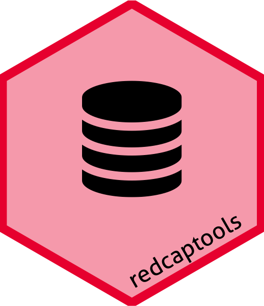
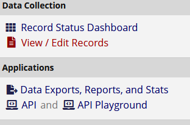

<!-- README.md is generated from README.Rmd. Please edit that file -->

# `redcaptools` 

<!-- badges: start -->

[](https://github.com/CTU-Bern/redcaptools)
[](https://github.com/CTU-Bern/redcaptools/actions)

<!-- badges: end -->

`redcaptools` contains home-grown functions for working with REDCap data
in R.

## Installation

You can install the development version of `redcaptools` from github
with:

<!-- install.packages("redcaptools") -->

``` r
remotes::install_github("CTU-Bern/redcaptools")
```

Or from CTU Bern’s package universe

``` r
install.packages("redcaptools", repos = c('https://ctu-bern.r-universe.dev', 'https://cloud.r-project.org'))
```

## Export data from REDCap

REDCap offers (at least) two approaches for exporting a projects data -
throught the web interface via clicking buttons, and the API, which
allows programmatic access to a lot more information than is available
through the web interface. In order to use the API, a token is required.
The API token can be requested from the projects API page, accessible
from the link in the applications section of the menu on the left side
of the page.



If you do not see that link, consult with whoever is in charge of user
management for the project to give you access to it.

Once you have access, you can request a token, which a system
administrator must approve. Once approved, the token is shown on the API
page. Now you have everything to download data through the API. Because
your token is essentially your username, password and a reference to a
specific project, extra care must be taken with it. The `httr` package
has a [vignette on managing
secrets](https://cran.r-project.org/web/packages/httr/vignettes/secrets.html),
which is relevant to the API token.

The standard download can be replicated via

``` r
# the URL ir the same as the website just with '/api/' on the end
url <- "https://redcap.domain.something/api/"
token <- readLines("path-to-file-containing-token") # or some other method
d <- redcap_export_tbl(token, url, "record")
```

More interesting is the `redcap_export_byform` function, which returns a
list of dataframes, where each element of the list is a specific eCRF
from the database.

``` r
l <- redcap_export_byform(token, url)
```

Some of the available metadata stored in REDCap is available via the
`redcap_export_meta` function, including the data dictionary, which can
also be downloaded via the website.

``` r
m <- redcap_export_meta(token, url)
```

Once you have the data and metadata, the `redcap_prep` function can be
used to reformat the data - convert variables to date, POSIX, factors,
etc as appropriate.

``` r
prepped <- redcap_prep(d, m$metadata)
prepped_list <- sapply(l, redcap_prep, metadata = m$metadata)
```
